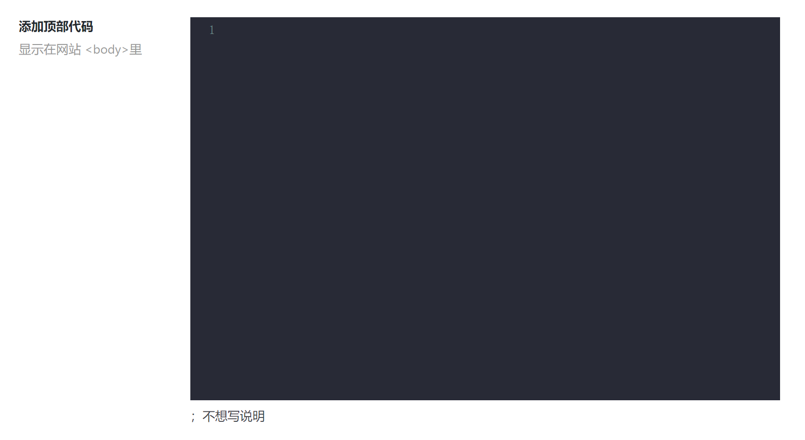

# 介绍
本项目是[OneNav](https://www.iotheme.cn/?aff=100057)（v3.0731）子主题

本主题是免费项目，请勿用于贩卖销售

## 功能

1. 主题后台增加另外的代码添加框

   位置

   ```
   添加代码-->添加顶部代码
   ```

   代码

   ```php
   <?php echo io_get_option('header_html');?>
   ```

   详情截图

   

   在此代码框输入页面结构，样式请添加在主题`自定义样式css代码`框内

   注意

   ```
   内容在用户未登录时显示，用户登陆后不加载，适用于添加提示用户登录代码
   ```

2. 更多功能待增加
1
